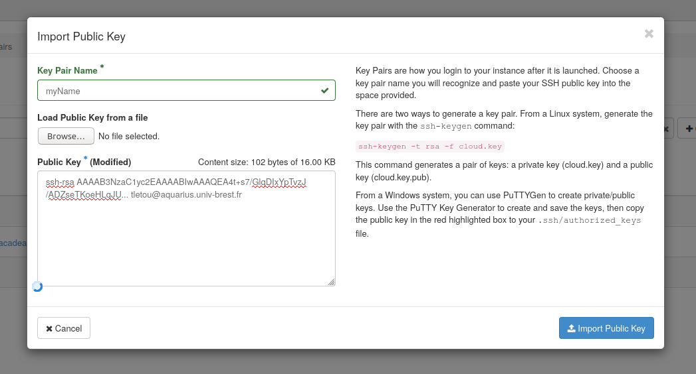

### Démarrer avec Ansible

 * Installation
 * Utilisation Adhoc
 * Mon premier YAML
 * Become or not to become

<!--s-->
<!-- .slide: data-background="./assets/background-laptop.jpg" -->
### Installation de Ansible

Ansible est un paquetage Python. Il s'installe sur une machine Linux via les **paquetages de distributions** ou **pip dans un virtualenv**.

Via les paquetages
```shell
sudo apt-get install ansible git
```
Via pip
```shell
sudo apt-get install virtualenvwrapper git
mkvirtualenv -p /usr/bin/python3 ansible
(ansible) pip install ansible
```

<!--s-->

<!-- .slide: data-background="./assets/background-cloud.jpg" -->
### Import de votre clef SSH dans OpenStack

Connexion sur : https://horizon.noocloud.space

**Compute** > **Key Pair** > **Import Public Key**



<!--s-->
<!-- .slide: data-background="./assets/background-cloud.jpg" -->
### Création d'une instance

**Compute** > **Instances** > **Launch instance**

 * Instance name : -_votreprenom_tp00
 * Source : ubuntu-cloudimage-18.04
 * Create New Volume : No
 * Flavor : m1.small
 * Key Pair : _la votre_

Mémorisez l'adresse de votre machine martyre.

<!--s-->
<!-- .slide: data-background="./assets/background-laptop.jpg" -->
### TP 00 Mode Adhoc

Commençons par récupérer les informations du TP
```bash
git clone https://github.com/tristanlt/cargodock-ansible.git
cd cargodock-ansible/tp/00
```
*(editez le fichier inventory.ini)*

Commande adhoc pour le ping
```bash
ansible test-server -m ping
```
Ça marche ? Passons en debug...
```
ansible -vvvv test-server -m ping
```

<!--s-->

# The End.

[La suite ?](20-inventaire.md)
